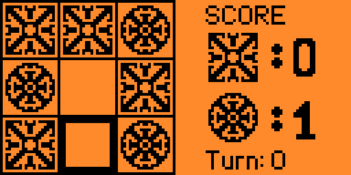

# ThemedTicTacToe

## Description

**Themed Tic Tac Toe** is a customized version of the classic Tic Tac Toe game, designed for the Flipper Zero device. In this game, players can use personalized icons for their moves.

## Features

- **Classic Gameplay**: Play Tic Tac Toe with traditional rules.
- **Customized Icons**: Themed icons to represent your moves (X and O).
- **Score Display**: View the victories for each player.
- **Turn Indicator**: Easily see whose turn it is.

##Preview

## Installation

1. Download the .fap file in the release page.
2. Transfer the file to your Flipper Zero.
3. Launch the game.

## License

This project is licensed under the [GPL-3.0 license](LICENSE).

## Contact

For suggestions, issues, or contributions use the Issues tab in this repository
